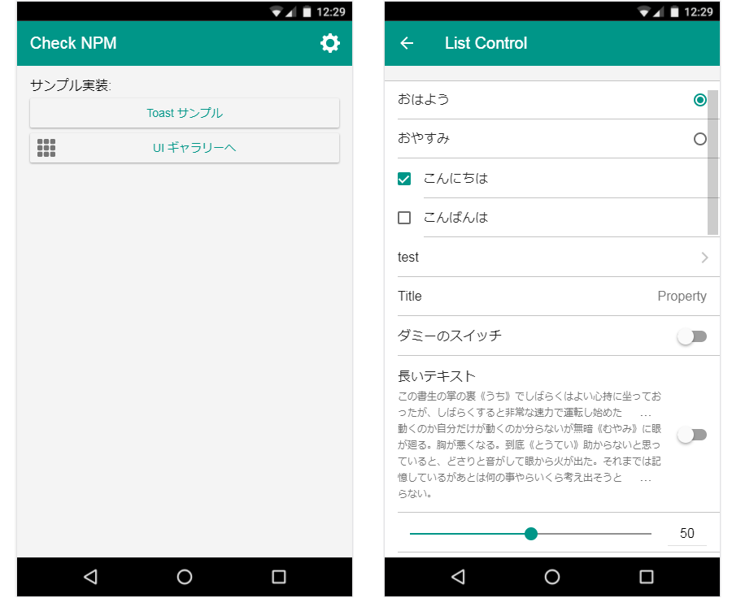
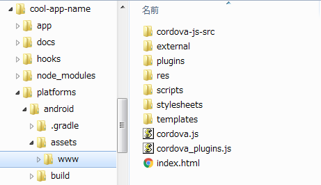
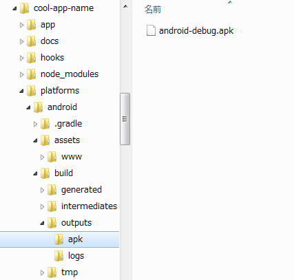
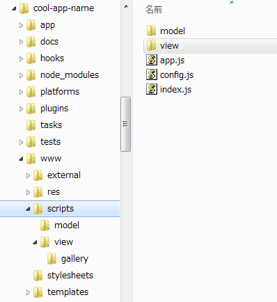
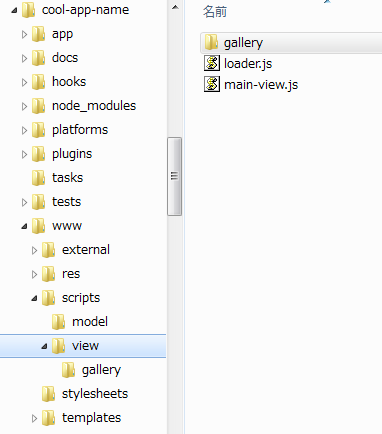
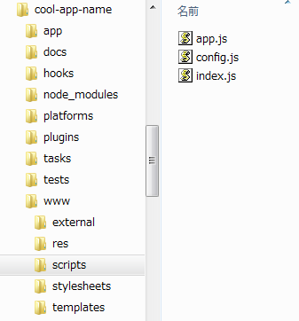

Quick Start Guide
======

- [開発環境構築](#DEVENV)
- [モバイルアプリ用 Boilerplate 作成](#BOILERPLATE)
    - [ディレクトリ構成](#BOILERPLATE_DIRECTORY)
- [ブラウザで確認する](#BROWSER)
- [実機で動かす](#DEVICE)
    - [cordova build で生成されるファイルの位置](#DEVICE_LOCATION)
    - [実機へのインストール](#DEVICE_INSTALL)
- [デバッグビルドとリリースビルド](#BUILD)
    - [ファイルの状態](#BUILD_FILE)
    - [script lazyload と AMD](#BUILD_LOADER)
- [サンプル実装](#SAMPLES)
- [コマンドラインから Boilerplate ドキュメントを閲覧する方法](#BOILERPLATE_DOCUMENT)

## <a name="DEVENV" />開発環境構築

| Requirement           | Mac                                                                 | Windows                                                             |
|:----------------------|:--------------------------------------------------------------------|:--------------------------------------------------------------------|
| Python 2.x            | Included                                                            | [Need To Install](https://www.python.org/downloads/)                |
| Node.js               | [Need To Install](http://nodejs.org/download/ )                     | [Need To Install](http://nodejs.org/download/ )                     |
| Cordova               | [Need To Install](http://cordova.apache.org/)                       | [Need To Install](http://cordova.apache.org/)                       |
| compiler for node-gyp | [Need To Setup](https://github.com/TooTallNate/node-gyp/)           | [Need To Install](https://github.com/TooTallNate/node-gyp/)         |
| phantomjs-prebuilt    | [Need To Install](https://www.npmjs.com/package/phantomjs-prebuilt) | [Need To Install](https://www.npmjs.com/package/phantomjs-prebuilt) |
| testem                | [Need To Install](https://www.npmjs.com/package/testem)             | [Need To Install](http://cordova.apache.org/)                       |


※ `phantomjs-prebuil` および `testem` はテストに使用. `-g` オプションでインストールすることを想定

```
$ npm install -g node-gyp
$ npm install -g phantomjs-prebuilt
$ npm install -g testem
```

雛形生成用、CLI モジュールのインストール

```
$ npm install -g cdp-cli
```

## <a name="BOILERPLATE" />モバイルアプリ用 Boilerplate 作成


```
$ cdp create mobile
```

質問に応答して、モバイルアプリ用雛形を作成します。  
以下は対象プラットフォームを `android` のみにし、ほかは既定値を選択した場合の例です。


```
================================================================

構成情報:                    おすすめ
  アプリ名:                  Cool App Name
  プロジェクト名:            cool-app-name
  アプリID:                  org.cool.appname
  バージョン:                0.0.1
  ライセンス:                プロプライエタリ(NONE)
  モジュールシステム:        AMD
  トランスパイルターゲット:  ES5

プラットフォーム:            android

Cordova プラグイン:
    cordova-plugin-cdp-nativebridge

追加モジュール:
    hogan.js
    hammerjs
    jquery-hammerjs

================================================================
```

### <a name="BOILERPLATE_DIRECTORY" />ディレクトリ構成

雛形のディレクトリ構成は以下のようになっています。


```
root/
    app/                    // モバイルアプリのソースを格納するルートディレクトリ
        external/           // 3rd パーティ製スクリプトを格納 (node_modules からコピーされる)
        res/                // リソースファイルのルートディレクトリ
        scripts/            // .ts ファイルのルートディレクトリ
        stylesheets/        // .scss  ファイルのルートディレクトリ
        templates/          // .html テンプレートファイルのルートディレクトリ
        index.html          // アプリケーションのルート index.html
    docs/                   // ドキュメントのルートディレクトリ
    hooks/                  // cordova hook scripts ディレクトリ
    plugins/                // cordova plugins ディレクトリ
    platforms/              // cordova platform ディレクトリ
    tasks/                  // タスクスクリプト用ディレクトリ
    tests/                  // テストスクリプト用ディレクトリ
    www/                    // ビルド後の配置用ディレクトリ
```

## <a name="BROWSER" />ブラウザで確認する

雛形の動作をブラウザ上で確認してみましょう。

```
$ cd cool-app-name
$ npm install
```

雛形をビルドするには、以下のコマンドを使用します。

```
$ npm run bulid:debug
```
すると、`www` 以下に、ビルド済みのファイル一式が生成されます。  
`www` を localhost のルートに指定して、Chrome ブラウザで開くと、以下のようなサンプル画面が確認できます。




## <a name="DEVICE" />実機で動かす

### <a name="DEVICE_LOCATION" />cordova build で生成されるファイルの位置

* 実機ビルドを行うと、以下にファイルが出力されます。

   ※ Windows 環境では、iOS ビルドはできないため、必ず `platform` を指定します。

```
$ cordova build android
```

`cool-app-name/platforms/android/assets/www/`



* `.apk` は以下に出力されます。

`cool-app-name/platforms/android/build/outputs/apk/`




### <a name="DEVICE_INSTALL" />実機へのインストール

* 実機へインストールするには、デバイスを PC に接続し、以下のコマンドを実行すると便利です。

```
$ cordova run android
```

## <a name="BUILD" />デバッグビルドとリリースビルド

開発時のデバッグビルドと、プロダクション用のリリースビルドに関する違いを説明します。

   各ビルドコマンドは以下です。その他のタスクコマンドは、[こちらを参照](https://github.com/sony/cdp-js/tree/master/packages/cafeteria/docs/ja#task--command-解説)してください。

* デバッグビルド
```
$ cordova build android
```

* リリースビルド
```
$ cordova build android --release
```

* **[Tips]** --no-minify オプション

   リリースビルドでは、既定で `minify` されてしまいますが、以下のコマンドを利用すれば、`minify` 抑止が可能です。

```
$ cordova build android --release --no-minify
```

### <a name="BUILD_FILE" />ファイルの状態

* デバッグビルドでは、各 `.ts` ファイルが、`.js` ファイルに 1:1 にコンパイルされます。






* 対して、リリースビルドでは、**モジュール単位** * に concat されて、最適化されてコンパイルされます。



※ デバッグビルドは、デバッグのしやすさを考慮して設計されており、ランタイム時のパフォーマンスは低下します。**プロダクション用にはリリースビルドを実行**するのが良いでしょう。

※ モジュール単位: ある機能の集合を1つの JavaScript ファイルに集約した単位。


## <a name="SAMPLES" />サンプル実装

そのほかのコンポーネントの使い方や、Native 連携のサンプル実装は  
[cafeteria](https://github.com/sony/cdp-js/tree/master/packages/cafeteria) アプリケーションで確認ができます。

## <a name="BOILERPLATE_DOCUMENT" />コマンドラインから Boilerplate ドキュメントを閲覧する方法

```
$ cdp doc (or $ cdp doc -p <port>)
```

コマンドラインから随時 Boilerplate 解説ドキュメントを呼び出して、ブラウザ表示させることもできます。
このドキュメントにより、アプリ作成の全体の流れを把握することができます（環境構築の仕方 ～ アプリ動作の仕組み ～ アプリひな形の作り方 ～ サンプルアプリ "LoginSPASample" 作成チュートリアル などを収録しています）。